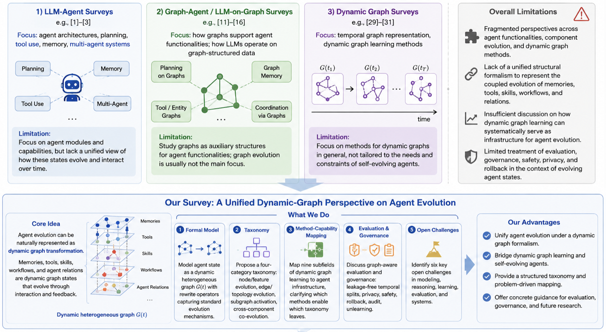
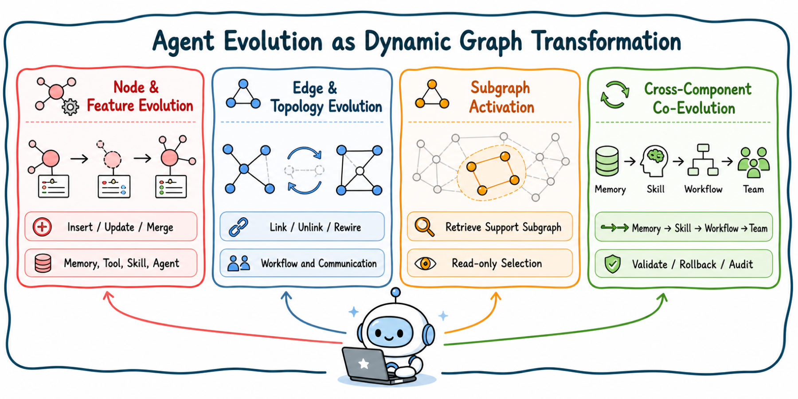
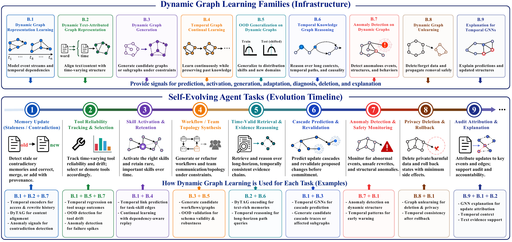
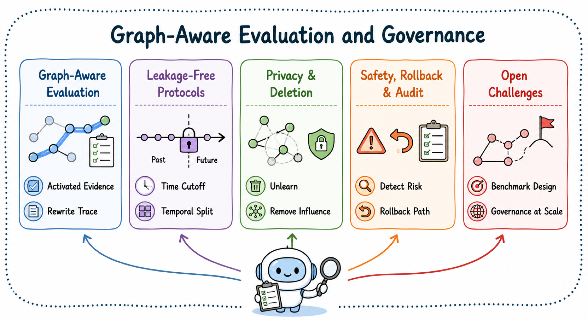
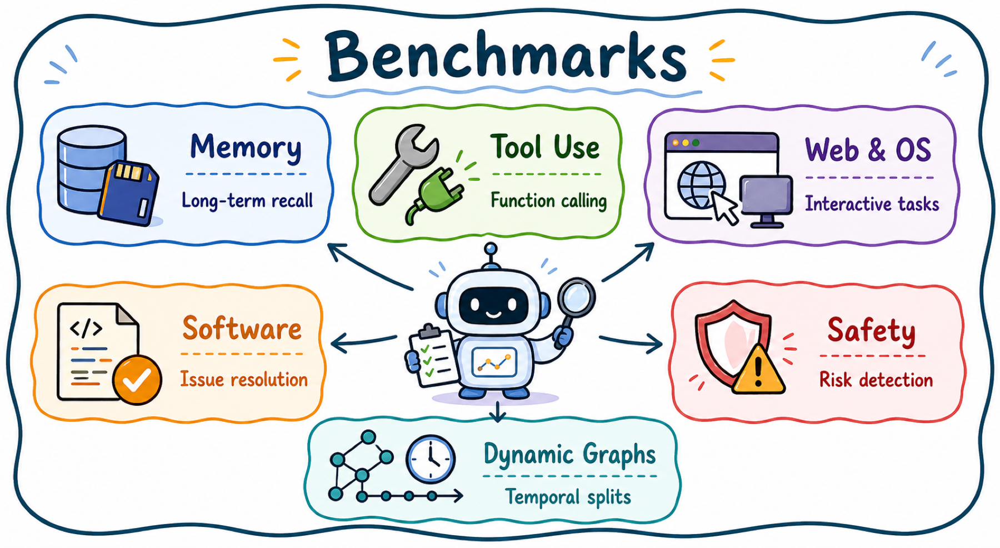

# Awesome Agent Dynamic Graphs

[](https://awesome.re)
[](https://www.researchgate.net/publication/406927066_Self-Evolving_Agents_as_Dynamic_Graph_Transformation_A_Survey_and_New_Perspective)
[](https://www.preprints.org/manuscript/202606.1695)
[](#contributing)


> [!NOTE]
> This repository organizes papers for **Self-Evolving Agents as Dynamic Graph Transformation: A Survey and New Perspective**, covering self-evolving agents, dynamic graph transformation, dynamic graph learning as agent infrastructure, and related benchmarks.




## 🔔 News

**[06/11/26]** 🚀 Our survey ***Self-Evolving Agents as Dynamic Graph Transformation: A Survey and New Perspective*** is now available on [ResearchGate](https://www.researchgate.net/publication/406927066_Self-Evolving_Agents_as_Dynamic_Graph_Transformation_A_Survey_and_New_Perspective/references). In this work, we provide a comprehensive survey and introduce a new perspective for discussing **Self-Evolving Agents** and **Dynamic Graph Learning**. We welcome contributions from these two communities to help expand and improve our survey 🤗!

**[06/08/26]** 📌 For readers interested in **more dynamic graph learning methods**, please refer to our related repository: [Awesome Dynamic Graph Learning](https://github.com/LuckyGirl-XU/Awesome-DynamicGraphLearning), which collects papers and resources on pure dynamic graph learning.

---

## 📋 Table of Contents

- [Agent Evolution as Dynamic Graph Transformation](#agent-evolution-as-dynamic-graph-transformation)
  - [Node and Feature Evolution](#node-and-feature-evolution)
  - [Edge and Topology Evolution](#edge-and-topology-evolution)
  - [Subgraph Activation](#subgraph-activation)
  - [Cross-Component Co-Evolution](#cross-component-co-evolution)
- [Dynamic Graph Learning as Agent-Evolution Infrastructure](#dynamic-graph-learning-as-agent-evolution-infrastructure)
  - [Dynamic Graph Learning](#dynamic-graph-learning)
  - [Dynamic Text-Attributed Graphs](#dynamic-text-attributed-graphs)
  - [Dynamic Graph Generation](#dynamic-graph-generation)
  - [Continual Learning on Dynamic Graphs](#continual-learning-on-dynamic-graphs)
  - [Out-of-Distribution Generalization on Dynamic Graphs](#out-of-distribution-generalization-on-dynamic-graphs)
  - [Temporal Knowledge Graph Reasoning](#temporal-knowledge-graph-reasoning)
  - [Anomaly Detection on Dynamic Graphs](#anomaly-detection-on-dynamic-graphs)
  - [Dynamic Graph Unlearning](#dynamic-graph-unlearning)
  - [Explanation for Temporal GNNs](#explanation-for-temporal-gnns)
- [Graph-Aware Evaluation and Governance](#graph-aware-evaluation-and-governance)
  - [Graph-Aware Evaluation](#graph-aware-evaluation)
  - [Leakage-Free Temporal Protocols](#leakage-free-temporal-protocols)
  - [Privacy and Deletion in Evolving Agent Graphs](#privacy-and-deletion-in-evolving-agent-graphs)
  - [Safety, Rollback, and Audit](#safety-rollback-and-audit)
  - [Open Challenges](#open-challenges)
- [Benchmarks](#benchmarks)
  - [Memory](#memory)
  - [Tool Use](#tool-use)
  - [Web & OS](#web--os)
  - [Software](#software)
  - [Safety](#safety)
  - [Dynamic Graphs](#dynamic-graphs)

---

## 🌟 Introduction

Large language model agents are becoming long-running systems that store memories, use tools, acquire skills, refine workflows, and collaborate with other agents. This repository follows a dynamic-graph view of these systems: evolving agent state is represented through typed nodes, edges, features, subgraphs, and temporal rewrites.

## 🏗️ Agent Evolution as Dynamic Graph Transformation



### Node and Feature Evolution

| Paper | Year |
| --- | --- |
| [Zep: A temporal knowledge graph architecture for agent memory](https://arxiv.org/abs/2501.13956) | 2025 |
| [A-MEM: Agentic Memory for LLM Agents](https://proceedings.neurips.cc/paper_files/paper/2025/hash/19909c36f51abc4856b4560aff3d36d6-Abstract-Conference.html) | 2025 |
| [MAGMA: A Multi-Graph based Agentic Memory Architecture for AI Agents](https://aclanthology.org/2026.acl-long.1709/) | 2026 |
| [APEX-MEM: Agentic Semi-Structured Memory with Temporal Reasoning for Long-Term Conversational AI](https://aclanthology.org/2026.acl-long.749/) | 2026 |
| [Structured Episodic Event Memory](https://aclanthology.org/2026.acl-long.277/) | 2026 |
| [HeLa-Mem: Hebbian Learning and Associative Memory for LLM Agents](https://aclanthology.org/2026.acl-long.625/) | 2026 |
| [ToolNet: Connecting large language models with massive tools via tool graph](https://arxiv.org/abs/2403.00839) | 2024 |
| [SkillOps: Managing LLM Agent Skill Libraries as Self-Maintaining Software Ecosystems](https://arxiv.org/abs/2605.13716) | 2026 |
| [A dynamic LLM-powered agent network for task-oriented agent collaboration](https://arxiv.org/abs/2310.02170) | 2024 |
| [TiMem: Temporal-Hierarchical Memory Consolidation for Long-Horizon Conversational Agents](https://arxiv.org/abs/2601.02845) | 2026 |
| [AriGraph: Learning Knowledge Graph World Models with Episodic Memory for LLM Agents](https://arxiv.org/abs/2407.04363) | 2025 |
| [GAAMA: Graph Augmented Associative Memory for Agents](https://arxiv.org/abs/2603.27910) | 2026 |
| [GAM: Hierarchical Graph-based Agentic Memory for LLM Agents](https://arxiv.org/abs/2604.12285) | 2026 |
| [GSEM: Graph-based Self-Evolving Memory for Experience Augmented Clinical Reasoning](https://arxiv.org/abs/2603.22096) | 2026 |
| [G-Memory: Tracing Hierarchical Memory for Multi-Agent Systems](https://arxiv.org/abs/2506.07398) | 2025 |
| [MemGPT: Towards LLMs as operating systems](https://arxiv.org/abs/2310.08560) | 2023 |
| [Memory OS of AI Agent](https://arxiv.org/abs/2506.06326) | 2025 |
| [MemMA: Coordinating the Memory Cycle through Multi-Agent Reasoning and In-Situ Self-Evolution](https://arxiv.org/abs/2603.18718) | 2026 |
| [MemRL: Self-Evolving Agents via Runtime Reinforcement Learning on Episodic Memory](https://arxiv.org/abs/2601.03192) | 2026 |
| [Evaluating very long-term conversational memory of LLM agents](https://aclanthology.org/2024.acl-long.747/) | 2024 |
| [LongMemEval: Benchmarking chat assistants on long-term interactive memory](https://arxiv.org/abs/2410.10813) | 2025 |
| [MemBench: Towards more comprehensive evaluation on the memory of LLM-based agents](https://aclanthology.org/2025.findings-acl.989/) | 2025 |
| [SkillGraph: Self-Evolving Multi-Agent Collaboration with Multimodal Graph Topology](https://arxiv.org/abs/2604.17503) | 2026 |
| [Graph of Skills: Dependency-Aware Structural Retrieval for Massive Agent Skills](https://arxiv.org/abs/2604.05333) | 2026 |
| [Voyager: An open-ended embodied agent with large language models](https://arxiv.org/abs/2305.16291) | 2024 |
| [ExpeL: LLM agents are experiential learners](https://doi.org/10.1609/aaai.v38i17.29936) | 2024 |
| [CoEvoSkills: Self-Evolving Agent Skills via Co-Evolutionary Verification](https://arxiv.org/abs/2604.01687) | 2026 |
| [EvoSkill: Automated Skill Discovery for Multi-Agent Systems](https://arxiv.org/abs/2603.02766) | 2026 |
| [SkillRL: Evolving Agents via Recursive Skill-Augmented Reinforcement Learning](https://arxiv.org/abs/2602.08234) | 2026 |
| [Agent Skill Acquisition for Large Language Models via CycleQD](https://arxiv.org/abs/2410.14735) | 2025 |
| [SEARL: Joint Optimization of Policy and Tool Graph Memory for Self-Evolving Agents](https://arxiv.org/abs/2604.07791) | 2026 |
| [NaviAgent: Bilevel Planning on Tool Navigation Graph for Large-Scale Orchestration](https://arxiv.org/abs/2506.19500) | 2025 |
| [Toolformer: Language models can teach themselves to use tools](https://arxiv.org/abs/2302.04761) | 2023 |
| [Gorilla: Large language model connected with massive APIs](https://arxiv.org/abs/2305.15334) | 2024 |
| [ToolLLM: Facilitating large language models to master 16000+ real-world APIs](https://arxiv.org/abs/2307.16789) | 2024 |
| [API-Bank: A comprehensive benchmark for tool-augmented LLMs](https://aclanthology.org/2023.emnlp-main.187/) | 2023 |
| [ToolSandbox: A stateful, conversational, interactive evaluation benchmark for LLM tool use capabilities](https://arxiv.org/abs/2408.04682) | 2025 |
| [The Berkeley Function Calling Leaderboard (BFCL): From Tool Use to Agentic Evaluation of Large Language Models](https://openreview.net/forum?id=2GmDdhBdDk) | 2025 |
| [ASTRA-bench: Evaluating Tool-Use Agent Reasoning and Action Planning with Personal User Context](https://arxiv.org/abs/2603.01357) | 2026 |
| [Cut the crap: An economical communication pipeline for LLM-based multi-agent systems](https://arxiv.org/abs/2410.02506) | 2025 |
| [AgentDropout: Dynamic Agent Elimination for Token-Efficient and High-Performance LLM-Based Multi-Agent Collaboration](https://arxiv.org/abs/2503.18891) | 2025 |
| [Learning Decentralized LLM Collaboration with Multi-Agent Actor Critic](https://arxiv.org/abs/2601.21972) | 2026 |
| [AgentScope: A flexible yet robust multi-agent platform](https://arxiv.org/abs/2402.14034) | 2024 |
| [R&D-Agent-Quant: A Multi-Agent Framework for Data-Centric Factors and Model Joint Optimization](https://proceedings.neurips.cc/paper_files/paper/2025/hash/ac5c2b6e423883cbcacbcccf88491b78-Abstract-Datasets_and_Benchmarks_Track.html) | 2025 |
| [Table-Critic: A Multi-Agent Framework for Collaborative Criticism and Refinement in Table Reasoning](https://arxiv.org/abs/2502.11799) | 2025 |
| [Verified Multi-Agent Orchestration: A Plan-Execute-Verify-Replan Framework for Complex Query Resolution](https://arxiv.org/abs/2603.11445) | 2026 |
| [Temporal graph networks for deep learning on dynamic graphs](https://arxiv.org/abs/2006.10637) | 2020 |

### Edge and Topology Evolution

| Paper | Year |
| --- | --- |
| [AFlow: Automating agentic workflow generation](https://arxiv.org/abs/2410.10762) | 2025 |
| [DynTaskMAS: A Dynamic Task Graph-driven Framework for Asynchronous and Parallel LLM-based Multi-Agent Systems](https://arxiv.org/abs/2503.07675) | 2025 |
| [Cut the crap: An economical communication pipeline for LLM-based multi-agent systems](https://arxiv.org/abs/2410.02506) | 2025 |
| [DyTopo: Dynamic Topology Routing for Multi-Agent Reasoning via Semantic Matching](https://arxiv.org/abs/2602.06039) | 2026 |
| [SkillOps: Managing LLM Agent Skill Libraries as Self-Maintaining Software Ecosystems](https://arxiv.org/abs/2605.13716) | 2026 |
| [NaviAgent: Bilevel Planning on Tool Navigation Graph for Large-Scale Orchestration](https://arxiv.org/abs/2506.19500) | 2025 |
| [Dynamic Generation of Multi-LLM Agents Communication Topologies with Graph Diffusion Models](https://arxiv.org/abs/2510.07799) | 2025 |
| [AgentConductor: Topology Evolution for Multi-Agent Competition-Level Code Generation](https://arxiv.org/abs/2602.17100) | 2026 |
| [GPTSwarm: Language agents as optimizable graphs](https://arxiv.org/abs/2402.16823) | 2024 |
| [MASS: Multi-Agent Design: Optimizing Agents with Better Prompts and Topologies](https://arxiv.org/abs/2502.02533) | 2025 |
| [ABSTRAL: Automatic Design of Multi-Agent Systems through Iterative Refinement and Topology Optimization](https://arxiv.org/abs/2603.22791) | 2026 |
| [Automated design of agentic systems](https://arxiv.org/abs/2408.08435) | 2025 |
| [A dynamic LLM-powered agent network for task-oriented agent collaboration](https://arxiv.org/abs/2310.02170) | 2024 |
| [TodyComm: Task-Oriented Dynamic Communication for Multi-Round LLM-based Multi-Agent System](https://arxiv.org/abs/2602.03688) | 2026 |
| [AgentNet: Decentralized Evolutionary Coordination for LLM-Based Multi-Agent Systems](https://proceedings.neurips.cc/paper_files/paper/2025/hash/9a379c1b05793d1c42dc832269834515-Abstract-Conference.html) | 2025 |
| [RUMAD: Reinforcement-Unifying Multi-Agent Debate](https://arxiv.org/abs/2602.23864) | 2026 |
| [ResMAS: Resilience Optimization in LLM-based Multi-agent Systems](https://arxiv.org/abs/2601.04694) | 2026 |
| [AMAS: Adaptively Determining Communication Topology for LLM-based Multi-Agent System](https://arxiv.org/abs/2510.01617) | 2025 |
| [G-Designer: Architecting Multi-Agent Communication Topologies via Graph Neural Networks](https://arxiv.org/abs/2410.11782) | 2025 |
| [Assemble Your Crew: Automatic Multi-Agent Communication Topology Design via Autoregressive Graph Generation](https://doi.org/10.1609/aaai.v40i28.39481) | 2026 |
| [Graph-of-Agents: A Graph-based Framework for Multi-Agent LLM Collaboration](https://arxiv.org/abs/2604.17148) | 2026 |
| [Adaptive Graph Pruning for Multi-Agent Communication](https://arxiv.org/abs/2506.02951) | 2025 |
| [GoAgent: Group-of-Agents Communication Topology Generation for LLM-Based Multi-Agent Systems](https://arxiv.org/abs/2603.19677) | 2026 |
| [TopoDIM: One-shot Topology Generation of Diverse Interaction Modes for Multi-Agent Systems](https://arxiv.org/abs/2601.10120) | 2026 |
| [HyperAgent: Leveraging Hypergraphs for Topology Optimization in Multi-Agent Communication](https://arxiv.org/abs/2510.10611) | 2026 |
| [AgentDropout: Dynamic Agent Elimination for Token-Efficient and High-Performance LLM-Based Multi-Agent Collaboration](https://arxiv.org/abs/2503.18891) | 2025 |
| [SafeSieve: From Heuristics to Experience in Progressive Pruning for LLM-Based Multi-Agent Communication](https://arxiv.org/abs/2508.11733) | 2026 |
| [DAGP: Difficulty-Aware Graph Pruning for LLM-Based Multi-Agent System](https://doi.org/10.1145/3746252.3760954) | 2025 |
| [Slade: Detecting dynamic anomalies in edge streams without labels via self-supervised learning](https://arxiv.org/abs/2402.11933) | 2024 |

### Subgraph Activation

| Paper | Year |
| --- | --- |
| [Think-on-Graph 3.0: Efficient and Adaptive LLM Reasoning on Heterogeneous Graphs via Multi-Agent Dual-Evolving Context Retrieval](https://arxiv.org/abs/2509.21710) | 2025 |
| [Zep: A temporal knowledge graph architecture for agent memory](https://arxiv.org/abs/2501.13956) | 2025 |
| [A dynamic LLM-powered agent network for task-oriented agent collaboration](https://arxiv.org/abs/2310.02170) | 2024 |
| [DyTopo: Dynamic Topology Routing for Multi-Agent Reasoning via Semantic Matching](https://arxiv.org/abs/2602.06039) | 2026 |
| [TopoDIM: One-shot Topology Generation of Diverse Interaction Modes for Multi-Agent Systems](https://arxiv.org/abs/2601.10120) | 2026 |
| [MemGPT: Towards LLMs as operating systems](https://arxiv.org/abs/2310.08560) | 2023 |
| [MemoryBank: Enhancing large language models with long-term memory](https://arxiv.org/abs/2305.10250) | 2024 |
| [Memory OS of AI Agent](https://arxiv.org/abs/2506.06326) | 2025 |
| [Assemble Your Crew: Automatic Multi-Agent Communication Topology Design via Autoregressive Graph Generation](https://doi.org/10.1609/aaai.v40i28.39481) | 2026 |
| [Voyager: An open-ended embodied agent with large language models](https://arxiv.org/abs/2305.16291) | 2024 |
| [AgentSquare: Automatic LLM agent search in modular design space](https://arxiv.org/abs/2410.06153) | 2025 |
| [DyFlow: Dynamic Workflow Framework for Agentic Reasoning](https://papers.nips.cc/paper_files/paper/2025/hash/fe9910d2b03324faeb5371a9658277bb-Abstract-Conference.html) | 2025 |
| [VIPAct: Visual-Perception Enhancement via Specialized VLM Agent Collaboration and Tool-Use](https://doi.org/10.1609/aaai.v40i43.40976) | 2026 |
| [AgentBench: Evaluating LLMs as agents](https://arxiv.org/abs/2308.03688) | 2024 |
| [GAIA: A benchmark for general AI assistants](https://arxiv.org/abs/2311.12983) | 2024 |
| [SWE-bench: Can language models resolve real-world GitHub issues?](https://arxiv.org/abs/2310.06770) | 2024 |
| [tau-bench: A benchmark for tool-agent-user interaction in real-world domains](https://arxiv.org/abs/2406.12045) | 2024 |
| [OSWorld: Benchmarking multimodal agents for open-ended tasks in real computer environments](https://doi.org/10.52202/079017-1650) | 2024 |
| [Mind2Web: Towards a generalist agent for the web](https://doi.org/10.52202/075280-1220) | 2023 |
| [Benchmarking Agentic Workflow Generation](https://arxiv.org/abs/2410.07869) | 2025 |
| [Ranking on dynamic graphs: An effective and robust band-pass disentangled approach](https://openreview.net/forum?id=cah0ZYeMz0) | 2025 |
| [Rush: Real-time burst subgraph detection in dynamic graphs](https://doi.org/10.14778/3681954.3682028) | 2024 |

### Cross-Component Co-Evolution

| Paper | Year |
| --- | --- |
| [MetaGen: Self-Evolving Roles and Topologies for Multi-Agent LLM Reasoning](https://arxiv.org/abs/2601.19290) | 2026 |
| [TacoMAS: Test-Time Co-Evolution of Topology and Capability in LLM-based Multi-Agent Systems](https://arxiv.org/abs/2605.09539) | 2026 |
| [SkillGraph: Self-Evolving Multi-Agent Collaboration with Multimodal Graph Topology](https://arxiv.org/abs/2604.17503) | 2026 |
| [Self-Evolving Multi-Agent Collaboration Networks for Software Development](https://openreview.net/forum?id=4R71pdPBZp) | 2025 |
| [TopoEvo: A Topology-Aware Self-Evolving Multi-Agent Framework for Root Cause Analysis in Microservices](https://arxiv.org/abs/2605.15611) | 2026 |
| [GUARDIAN: Safeguarding LLM Multi-Agent Collaborations with Temporal Graph Modeling](https://arxiv.org/abs/2505.19234) | 2025 |
| [SentinelAgent: Graph-based Anomaly Detection in Multi-Agent Systems](https://arxiv.org/abs/2505.24201) | 2025 |
| [G-Safeguard: A Topology-Guided Security Lens and Treatment on LLM-Based Multi-Agent Systems](https://aclanthology.org/2025.acl-long.359/) | 2025 |
| [Self-Refine: Iterative refinement with self-feedback](https://doi.org/10.52202/075280-2019) | 2023 |
| [ExpeL: LLM agents are experiential learners](https://doi.org/10.1609/aaai.v38i17.29936) | 2024 |
| [Agent hospital: A simulacrum of hospital with evolvable medical agents](https://arxiv.org/abs/2405.02957) | 2024 |
| [AutoAct: Automatic agent learning from scratch for QA via self-planning](https://arxiv.org/abs/2401.05268) | 2024 |
| [Synthesizing Multi-Agent Harnesses for Vulnerability Discovery](https://arxiv.org/abs/2604.20801) | 2026 |
| [A Safety and Security Framework for Real-World Agentic Systems](https://arxiv.org/abs/2511.21990) | 2025 |
| [On-Policy Self-Evolution via Failure Trajectories for Agentic Safety Alignment](https://arxiv.org/abs/2605.11882) | 2026 |
| [DyTopo: Dynamic Topology Routing for Multi-Agent Reasoning via Semantic Matching](https://arxiv.org/abs/2602.06039) | 2026 |

---

## 🧠 Dynamic Graph Learning as Agent-Evolution Infrastructure



### Dynamic Graph Representation Learning

| Paper | Year |
| --- | --- |
| [UniDyG: A Unified and Effective Representation Learning Approach for Large Dynamic Graphs](https://doi.org/10.1109/TKDE.2025.3566064) | 2025 |
| [Temporal graph networks for deep learning on dynamic graphs](https://arxiv.org/abs/2006.10637) | 2020 |
| [Towards better dynamic graph learning: New architecture and unified library](https://doi.org/10.52202/075280-2960) | 2023 |
| [Do we really need complicated model architectures for temporal networks?](https://arxiv.org/abs/2302.11636) | 2023 |
| [FreeDyG: Frequency Enhanced Continuous-Time Dynamic Graph Model for Link Prediction](https://openreview.net/forum?id=82Mc5ilInM) | 2024 |
| [SALoM: Structure Aware Temporal Graph Networks with Long-Short Memory Updater](https://papers.neurips.cc/paper_files/paper/2025/hash/20f94998511f25bb6378cae0e098bc46-Abstract-Conference.html) | 2025 |
| [Simple: Efficient temporal graph neural network training at scale with dynamic data placement](https://doi.org/10.1145/3654977) | 2024 |
| [ETC: Efficient Training of Temporal Graph Neural Networks over Large-Scale Dynamic Graphs](https://doi.org/10.14778/3641204.3641215) | 2024 |
| [On the scalability of temporal relative positional encoding for dynamic link prediction](https://doi.org/10.1145/3711896.3737069) | 2025 |
| [Repeat-Aware Neighbor Sampling for Dynamic Graph Learning](https://doi.org/10.1145/3637528.3672001) | 2024 |
| [Neighborhood-aware scalable temporal network representation learning](https://arxiv.org/abs/2209.01084) | 2022 |
| [Long Range Propagation on Continuous-Time Dynamic Graphs](https://arxiv.org/abs/2406.02740) | 2024 |
| [Robust knowledge adaptation for dynamic graph neural networks](https://doi.org/10.1109/TKDE.2024.3388453) | 2024 |
| [Co-Neighbor Encoding Schema: A Light-cost Structure Encoding Method for Dynamic Link Prediction](https://arxiv.org/abs/2407.20871) | 2024 |
| [Retrieval augmented generation for dynamic graph modeling](https://arxiv.org/abs/2408.14523) | 2025 |
| [Towards better evaluation for dynamic link prediction](https://arxiv.org/abs/2207.10128) | 2022 |
| [Event-based dynamic graph representation learning for patent application trend prediction](https://doi.org/10.1109/TKDE.2023.3312333) | 2024 |
| [Representation learning for dynamic graphs: A survey](https://jmlr.org/papers/v21/19-447.html) | 2020 |
| [State space models on temporal graphs: A first-principles study](https://arxiv.org/abs/2406.00943) | 2024 |
| [Supra-laplacian encoding for transformer on dynamic graphs](https://arxiv.org/abs/2409.17986) | 2024 |
| [Foundations and modeling of dynamic networks using dynamic graph neural networks: A survey](https://doi.org/10.1109/ACCESS.2021.3082932) | 2021 |
| [Graph neural networks for temporal graphs: State of the art, open challenges, and opportunities](https://arxiv.org/abs/2302.01018) | 2023 |
| [dyngraph2vec: Capturing network dynamics using dynamic graph representation learning](https://doi.org/10.1016/j.knosys.2019.06.024) | 2020 |
| [DySAT: Deep neural representation learning on dynamic graphs via self-attention networks](https://arxiv.org/abs/1812.09430) | 2020 |
| [EvolveGCN: Evolving graph convolutional networks for dynamic graphs](https://doi.org/10.1609/aaai.v34i04.5984) | 2020 |
| [ROLAND: Graph learning framework for dynamic graphs](https://doi.org/10.1145/3534678.3539300) | 2022 |
| [A novel representation learning for dynamic graphs based on graph convolutional networks](https://doi.org/10.1109/TCYB.2022.3159661) | 2022 |
| [HGWaveNet: A Hyperbolic Graph Neural Network for Temporal Link Prediction](https://arxiv.org/abs/2304.07302) | 2023 |
| [SEIGN: A Simple and Efficient Graph Neural Network for Large Dynamic Graphs](https://doi.org/10.1109/ICDE55515.2023.00218) | 2023 |
| [An Attentional Multi-scale Co-evolving Model for Dynamic Link Prediction](https://dl.acm.org/doi/10.1145/3543507.3583396) | 2023 |
| [Scaling Up Dynamic Graph Representation Learning via Spiking Neural Networks](https://arxiv.org/abs/2208.10364) | 2023 |
| [High-quality temporal link prediction for weighted dynamic graphs via inductive embedding aggregation](https://doi.org/10.1109/TKDE.2023.3238360) | 2023 |

### Dynamic Text-Attributed Graphs

| Paper | Year |
| --- | --- |
| [DTGB: A comprehensive benchmark for dynamic text-attributed graphs](https://doi.org/10.52202/079017-2901) | 2024 |
| [Unlocking multi-modal potentials for link prediction on dynamic text-attributed graphs](https://arxiv.org/abs/2502.19651) | 2026 |
| [Unifying Text Semantics and Graph Structures for Temporal Text-attributed Graphs with Large Language Models](https://arxiv.org/abs/2503.14411) | 2025 |
| [LLM-driven Knowledge Distillation for Dynamic Text-Attributed Graphs](https://arxiv.org/abs/2502.10914) | 2025 |
| [Global-Recent Semantic Reasoning on Dynamic Text-Attributed Graphs with Large Language Models](https://arxiv.org/abs/2509.18742) | 2025 |
| [Exploring the potential of large language models as predictors in dynamic text-attributed graphs](https://arxiv.org/abs/2503.03258) | 2025 |

### Dynamic Graph Generation

| Paper | Year |
| --- | --- |
| [TG-GAN: Continuous-time temporal graph deep generative models with time-validity constraints](https://doi.org/10.1145/3442381.3449818) | 2021 |
| [A data-driven graph generative model for temporal interaction networks](https://doi.org/10.1145/3394486.3403082) | 2020 |
| [TIGGER: Scalable generative modelling for temporal interaction graphs](https://doi.org/10.1609/aaai.v36i6.20638) | 2022 |
| [A deep probabilistic framework for continuous time dynamic graph generation](https://arxiv.org/abs/2412.15582) | 2025 |
| [Efficient dynamic attributed graph generation](https://arxiv.org/abs/2412.08810) | 2025 |
| [GDGB: A Benchmark for Generative Dynamic Text-Attributed Graph Learning](https://arxiv.org/abs/2507.03267) | 2026 |

### Continual Learning on Dynamic Graphs

| Paper | Year |
| --- | --- |
| [A Selective Learning Method for Temporal Graph Continual Learning](https://arxiv.org/abs/2503.01580) | 2025 |
| [TOWARDS OPEN TEMPORAL GRAPH NEURAL NETWORKS](https://arxiv.org/abs/2303.15015) | 2023 |
| [Continual learning on dynamic graphs via parameter isolation](https://doi.org/10.1145/3539618.3591652) | 2023 |

### Out-of-Distribution Generalization on Dynamic Graphs

| Paper | Year |
| --- | --- |
| [Dynamic graph neural networks under spatio-temporal distribution shift](https://doi.org/10.52202/068431-0440) | 2022 |
| [Spectral invariant learning for dynamic graphs under distribution shifts](https://doi.org/10.52202/075280-0290) | 2023 |
| [Environment-Aware Dynamic Graph Learning for Out-of-Distribution Generalization](https://doi.org/10.52202/075280-2164) | 2023 |
| [Evolving Graph Learning for Out-of-Distribution Generalization in Non-stationary Environments](https://arxiv.org/abs/2511.02354) | 2026 |

### Temporal Knowledge Graph Reasoning

| Paper | Year |
| --- | --- |
| [Explainable subgraph reasoning for forecasting on temporal knowledge graphs](https://openreview.net/forum?id=pGIHq1m7PU) | 2021 |
| [HyTE: Hyperplane-based temporally aware knowledge graph embedding](https://aclanthology.org/D18-1225/) | 2018 |
| [TeMP: Temporal message passing for temporal knowledge graph completion](https://aclanthology.org/2020.emnlp-main.462/) | 2020 |
| [Tensor decompositions for temporal knowledge base completion](https://arxiv.org/abs/2004.04926) | 2020 |
| [Know-Evolve: Deep temporal reasoning for dynamic knowledge graphs](https://arxiv.org/abs/1705.05742) | 2017 |
| [Recurrent Event Network: Autoregressive Structure Inference over Temporal Knowledge Graphs](https://aclanthology.org/2020.emnlp-main.541/) | 2020 |
| [Learning from history: Modeling temporal knowledge graphs with sequential copy-generation networks](https://doi.org/10.1609/aaai.v35i5.16604) | 2021 |
| [Temporal knowledge graph reasoning based on evolutional representation learning](https://doi.org/10.1145/3404835.3462963) | 2021 |
| [Integrate Temporal Graph Learning into LLM-based Temporal Knowledge Graph Model](https://arxiv.org/abs/2501.11911) | 2025 |
| [Enhancing Temporal Knowledge Graph Forecasting with Large Language Models via Chain-of-History Reasoning](https://arxiv.org/abs/2402.14382) | 2024 |
| [GenTKG: Generative forecasting on temporal knowledge graph with large language models](https://aclanthology.org/2024.findings-naacl.268/) | 2024 |

### Anomaly Detection on Dynamic Graphs

| Paper | Year |
| --- | --- |
| [AgentDojo: A dynamic environment to evaluate prompt injection attacks and defenses for LLM agents](https://doi.org/10.52202/079017-2636) | 2024 |
| [Agent security bench (ASB): Formalizing and benchmarking attacks and defenses in LLM-based agents](https://arxiv.org/abs/2410.02644) | 2025 |
| [Not what you've signed up for: Compromising real-world LLM-integrated applications with indirect prompt injection](https://doi.org/10.1145/3605764.3623985) | 2023 |
| [SentinelAgent: Graph-based Anomaly Detection in Multi-Agent Systems](https://arxiv.org/abs/2505.24201) | 2025 |
| [Anomaly Detection in Dynamic Graphs: A Comprehensive Survey](https://doi.org/10.1145/3669906) | 2024 |
| [Structural temporal graph neural networks for anomaly detection in dynamic graphs](https://doi.org/10.1145/3459637.3481955) | 2021 |
| [Anonymous Edge Representation for Inductive Anomaly Detection in Dynamic Bipartite Graph](https://doi.org/10.14778/3579075.3579088) | 2023 |
| [AddGraph: Anomaly detection in dynamic graph using attention-based temporal GCN](https://www.ijcai.org/proceedings/2019/614) | 2019 |
| [Anomaly detection in dynamic graphs via transformer](https://doi.org/10.1109/TKDE.2021.3124061) | 2023 |
| [Slade: Detecting dynamic anomalies in edge streams without labels via self-supervised learning](https://arxiv.org/abs/2402.11933) | 2024 |

### Dynamic Graph Unlearning

| Paper | Year |
| --- | --- |
| [Dynamic graph unlearning: a general and efficient post-processing method via gradient transformation](https://arxiv.org/abs/2405.14407) | 2025 |
| [Spatio-Temporal Graph Unlearning](https://arxiv.org/abs/2511.09404) | 2025 |

### Explanation for Temporal GNNs

| Paper | Year |
| --- | --- |
| [Explaining temporal graph models through an explorer-navigator framework](https://openreview.net/forum?id=BR_ZhvcYbGJ) | 2023 |
| [DyExplainer: Self-explainable dynamic graph neural network with sparse attentions](https://doi.org/10.1145/3729173) | 2025 |
| [Causality-inspired spatial-temporal explanations for dynamic graph neural networks](https://openreview.net/forum?id=AJBkfwXh3u) | 2024 |

---

## ⚙️ Graph-Aware Evaluation and Governance



### Graph-Aware Evaluation

| Paper | Year |
| --- | --- |
| [Evaluating White Matter Lesion Segmentations with Refined Sørensen-Dice Analysis](https://doi.org/10.1038/s41598-020-64803-w) | 2020 |
| [Evaluating very long-term conversational memory of LLM agents](https://aclanthology.org/2024.acl-long.747/) | 2024 |
| [LongMemEval: Benchmarking chat assistants on long-term interactive memory](https://arxiv.org/abs/2410.10813) | 2025 |
| [MemBench: Towards more comprehensive evaluation on the memory of LLM-based agents](https://aclanthology.org/2025.findings-acl.989/) | 2025 |
| [From local to global: A graph RAG approach to query-focused summarization](https://arxiv.org/abs/2404.16130) | 2024 |
| [Graph retrieval-augmented generation: A survey](https://arxiv.org/abs/2408.08921) | 2025 |
| [Locating and editing factual associations in GPT](https://arxiv.org/abs/2202.05262) | 2022 |
| [Mass-editing memory in a transformer](https://arxiv.org/abs/2210.07229) | 2023 |
| [Fast model editing at scale](https://arxiv.org/abs/2110.11309) | 2022 |
| [Editing large language models: Problems, methods, and opportunities](https://aclanthology.org/2023.emnlp-main.632/) | 2023 |
| [ToolSandbox: A stateful, conversational, interactive evaluation benchmark for LLM tool use capabilities](https://arxiv.org/abs/2408.04682) | 2025 |
| [The Berkeley Function Calling Leaderboard (BFCL): From Tool Use to Agentic Evaluation of Large Language Models](https://openreview.net/forum?id=2GmDdhBdDk) | 2025 |
| [AgentBench: Evaluating LLMs as agents](https://arxiv.org/abs/2308.03688) | 2024 |
| [WebArena: A realistic web environment for building autonomous agents](https://arxiv.org/abs/2307.13854) | 2024 |
| [VisualWebArena: Evaluating multimodal agents on realistic visual web tasks](https://aclanthology.org/2024.acl-long.50/) | 2024 |
| [Mind2Web: Towards a generalist agent for the web](https://doi.org/10.52202/075280-1220) | 2023 |
| [WebVoyager: Building an end-to-end web agent with large multimodal models](https://aclanthology.org/2024.acl-long.371/) | 2024 |
| [TravelPlanner: A benchmark for real-world planning with language agents](https://arxiv.org/abs/2402.01622) | 2024 |
| [OSWorld: Benchmarking multimodal agents for open-ended tasks in real computer environments](https://doi.org/10.52202/079017-1650) | 2024 |
| [AppWorld: A controllable world of apps and people for benchmarking interactive coding agents](https://aclanthology.org/2024.acl-long.850/) | 2024 |
| [SWE-bench: Can language models resolve real-world GitHub issues?](https://arxiv.org/abs/2310.06770) | 2024 |
| [Introducing SWE-bench Verified](https://openai.com/index/introducing-swe-bench-verified/) | 2024 |
| [SaaSBench: Exploring the Boundaries of Coding Agents in Long-Horizon Enterprise SaaS Engineering](https://arxiv.org/abs/2605.17526) | 2026 |

<sub><em>These related works highlight the necessity of Graph-Aware Evaluation.</em></sub>

### Leakage-Free Temporal Protocols

| Paper | Year |
| --- | --- |
| [Temporal graph benchmark for machine learning on temporal graphs](https://doi.org/10.52202/075280-0099) | 2023 |
| [Towards better evaluation for dynamic link prediction](https://doi.org/10.52202/068431-2386) | 2022 |

### Privacy and Deletion in Evolving Agent Graphs

| Paper | Year |
| --- | --- |
| [Graph unlearning](https://doi.org/10.1145/3548606.3559352) | 2022 |
| [Efficient model updates for approximate unlearning of graph-structured data](https://openreview.net/forum?id=fhcu4FBLciL) | 2023 |
| [GIF: A general graph unlearning strategy via influence function](https://doi.org/10.1145/3543507.3583521) | 2023 |
| [GNNDelete: A general strategy for unlearning in graph neural networks](https://arxiv.org/abs/2302.13406) | 2023 |

### Safety, Rollback, and Audit

| Paper | Year |
| --- | --- |
| [Identifying the risks of LM agents with an LM-emulated sandbox](https://arxiv.org/abs/2309.15817) | 2024 |
| [AgentDojo: A dynamic environment to evaluate prompt injection attacks and defenses for LLM agents](https://doi.org/10.52202/079017-2636) | 2024 |
| [AgentHarm: A benchmark for measuring harmfulness of LLM agents](https://arxiv.org/abs/2410.09024) | 2025 |
| [Agent security bench (ASB): Formalizing and benchmarking attacks and defenses in LLM-based agents](https://arxiv.org/abs/2410.02644) | 2025 |
| [Explainability in graph neural networks: A taxonomic survey](https://doi.org/10.1109/TPAMI.2022.3204236) | 2023 |
| [Explaining temporal graph models through an explorer-navigator framework](https://openreview.net/forum?id=BR_ZhvcYbGJ) | 2023 |
| [Causality-inspired spatial-temporal explanations for dynamic graph neural networks](https://openreview.net/forum?id=AJBkfwXh3u) | 2024 |

### Open Challenges

| Paper | Year |
| --- | --- |
| [Learning Query-Aware Budget-Tier Routing for Runtime Agent Memory](https://arxiv.org/abs/2602.06025) | 2026 |
| [ToolNet: Connecting large language models with massive tools via tool graph](https://arxiv.org/abs/2403.00839) | 2024 |
| [NaviAgent: Bilevel Planning on Tool Navigation Graph for Large-Scale Orchestration](https://arxiv.org/abs/2506.19500) | 2025 |
| [SkillOps: Managing LLM Agent Skill Libraries as Self-Maintaining Software Ecosystems](https://arxiv.org/abs/2605.13716) | 2026 |
| [TacoMAS: Test-Time Co-Evolution of Topology and Capability in LLM-based Multi-Agent Systems](https://arxiv.org/abs/2605.09539) | 2026 |

<sub><em>These related works motivate our Open Challenges.</em></sub>

---

## 📊 Benchmarks



### Memory

| Paper | Year |
| --- | --- |
| [Evaluating very long-term conversational memory of LLM agents](https://aclanthology.org/2024.acl-long.747/) | 2024 |
| [LongMemEval: Benchmarking chat assistants on long-term interactive memory](https://arxiv.org/abs/2410.10813) | 2025 |
| [MemBench: Towards more comprehensive evaluation on the memory of LLM-based agents](https://aclanthology.org/2025.findings-acl.989/) | 2025 |

### Tool Use

| Paper | Year |
| --- | --- |
| [API-Bank: A comprehensive benchmark for tool-augmented LLMs](https://aclanthology.org/2023.emnlp-main.187/) | 2023 |
| [ToolSandbox: A stateful, conversational, interactive evaluation benchmark for LLM tool use capabilities](https://arxiv.org/abs/2408.04682) | 2025 |
| [The Berkeley Function Calling Leaderboard (BFCL): From Tool Use to Agentic Evaluation of Large Language Models](https://openreview.net/forum?id=2GmDdhBdDk) | 2025 |
| [ASTRA-bench: Evaluating Tool-Use Agent Reasoning and Action Planning with Personal User Context](https://arxiv.org/abs/2603.01357) | 2026 |
| [AgentBench: Evaluating LLMs as agents](https://arxiv.org/abs/2308.03688) | 2024 |
| [GAIA: A benchmark for general AI assistants](https://arxiv.org/abs/2311.12983) | 2024 |
| [TravelPlanner: A benchmark for real-world planning with language agents](https://arxiv.org/abs/2402.01622) | 2024 |
| [tau-bench: A benchmark for tool-agent-user interaction in real-world domains](https://arxiv.org/abs/2406.12045) | 2024 |
| [Benchmarking Agentic Workflow Generation](https://arxiv.org/abs/2410.07869) | 2025 |

### Web & OS

| Paper | Year |
| --- | --- |
| [WebArena: A realistic web environment for building autonomous agents](https://arxiv.org/abs/2307.13854) | 2024 |
| [VisualWebArena: Evaluating multimodal agents on realistic visual web tasks](https://aclanthology.org/2024.acl-long.50/) | 2024 |
| [Mind2Web: Towards a generalist agent for the web](https://doi.org/10.52202/075280-1220) | 2023 |
| [WebVoyager: Building an end-to-end web agent with large multimodal models](https://aclanthology.org/2024.acl-long.371/) | 2024 |
| [OSWorld: Benchmarking multimodal agents for open-ended tasks in real computer environments](https://doi.org/10.52202/079017-1650) | 2024 |

### Software

| Paper | Year |
| --- | --- |
| [AppWorld: A controllable world of apps and people for benchmarking interactive coding agents](https://aclanthology.org/2024.acl-long.850/) | 2024 |
| [SWE-bench: Can language models resolve real-world GitHub issues?](https://arxiv.org/abs/2310.06770) | 2024 |
| [Introducing SWE-bench Verified](https://openai.com/index/introducing-swe-bench-verified/) | 2024 |
| [SaaSBench: Exploring the Boundaries of Coding Agents in Long-Horizon Enterprise SaaS Engineering](https://arxiv.org/abs/2605.17526) | 2026 |

### Safety

| Paper | Year |
| --- | --- |
| [Identifying the risks of LM agents with an LM-emulated sandbox](https://arxiv.org/abs/2309.15817) | 2024 |
| [AgentDojo: A dynamic environment to evaluate prompt injection attacks and defenses for LLM agents](https://doi.org/10.52202/079017-2636) | 2024 |
| [AgentHarm: A benchmark for measuring harmfulness of LLM agents](https://arxiv.org/abs/2410.09024) | 2025 |
| [Agent security bench (ASB): Formalizing and benchmarking attacks and defenses in LLM-based agents](https://arxiv.org/abs/2410.02644) | 2025 |

### Dynamic Graphs

| Paper | Year |
| --- | --- |
| [Temporal graph benchmark for machine learning on temporal graphs](https://doi.org/10.52202/075280-0099) | 2023 |
| [Towards better evaluation for dynamic link prediction](https://arxiv.org/abs/2207.10128) | 2022 |
| [DTGB: A comprehensive benchmark for dynamic text-attributed graphs](https://doi.org/10.52202/079017-2901) | 2024 |
| [GDGB: A Benchmark for Generative Dynamic Text-Attributed Graph Learning](https://arxiv.org/abs/2507.03267) | 2026 |

---

## 🤝 Contributing

This collection is an ongoing effort. We are actively expanding and refining its coverage, and welcome suggestions from the community. You can:

* Open an issue to suggest additional papers or resources

* Email us at [yuanyuan.xu@unsw.edu.au](mailto:yuanyuan.xu@unsw.edu.au), [yin.chen@student.uts.edu.au](mailto:yin.chen@student.uts.edu.au)

We regularly update the repository to include new research works on self-evolving agents and dynamic graph transformation.

## 📝 Citation

If you find this repository useful, please consider citing the survey paper:

```bibtex
@article{xu2026selfevolving,
  title={Self-Evolving Agents as Dynamic Graph Transformation: A Survey and New Perspective},
  author={Xu, Yuanyuan and Zhang, Wenjie and Chen, Yin and Lin, Xuemin and Zhang, Ying},
  journal = {Preprints},
  doi = {10.20944/preprints202606.1695.v1},
  year = {2026}
}

```
